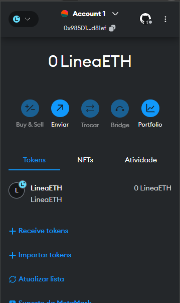

## Repositório para a criação de um novo Token

- Foi utilizado Remix IDE, MEtamask, ethereum faucet

### Metamask: 

#### Carteira: 0x985D15c38260c5d8CdA3730E8D71867A9d6d81ef

Obs.: Não é mais possível usar a rede Goerli para teste. Também não foi possível conseguir os ether necessários para pagar a criação do Token.